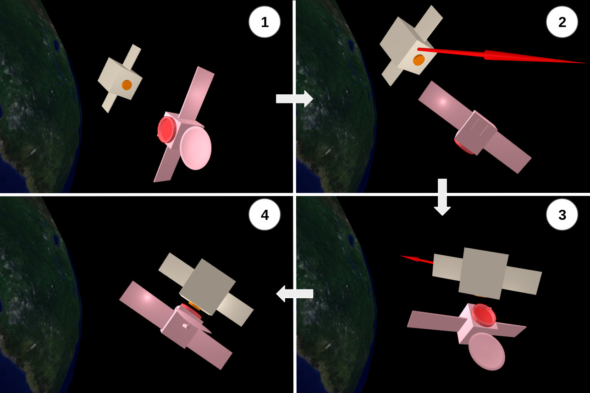

# Soft Capture of Tumbling Space Objects 

Code accompanying the paper ["A Convex Formulation of the Soft-Capture Problem"](https://arxiv.org/abs/2405.00867). Run `examples/scp.jl` after installation.

This repository contains:
- An implementation of the convex trajectory optimization algorithm described in the paper.
- A dynamics simulator for the maneuver.
- Full examples with provided geometric models for a chaser and a target satellite in the `examples/` directory.
- A Meshcat-based visualizer.

The algorithm requires a Second-Order Cone Programming solver compatible with Convex.jl. The examples in the paper were run using an academic license of the MOSEK solver (see `examples/properties.jl`).

## Installation

In the Julia REPL
```
using Pkg
Pkg.activate(".")
# Pkg.add(url="https://github.com/RoboticExplorationLab/SoftCapture")
Pkg.instantiate()
```

## Citation

If you use any part of this code as part of your research, teaching, or other activities, we would be grateful if you could cite our paper:

```
@article{sow2024convex,
        title={A Convex Formulation of the Soft-Capture Problem}, 
        author={Sow, Ibrahima S. and Gutow, Geordan and Choset, Howie and Manchester, Zachary},
        year={2024},
        url = {https://arxiv.org/abs/2405.00867},
}
```

